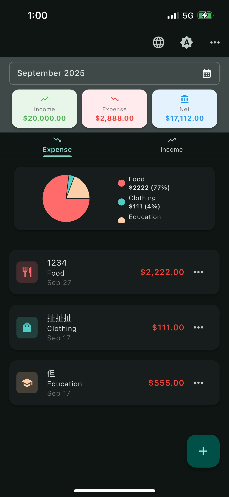
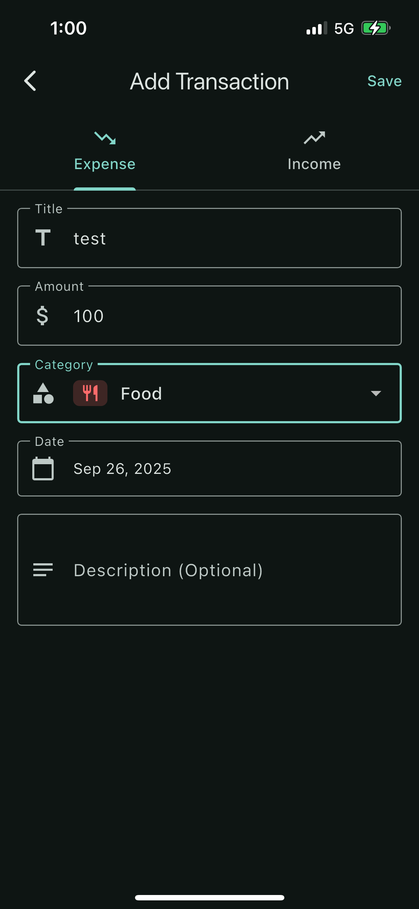
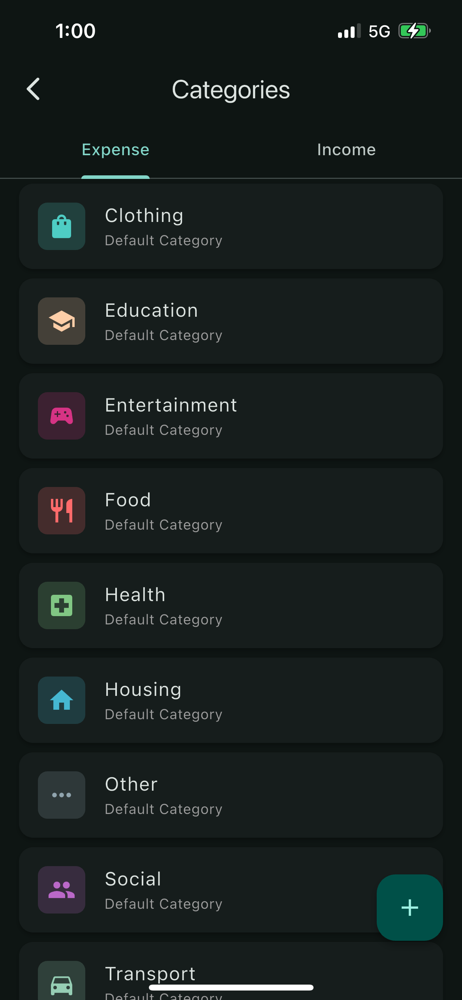
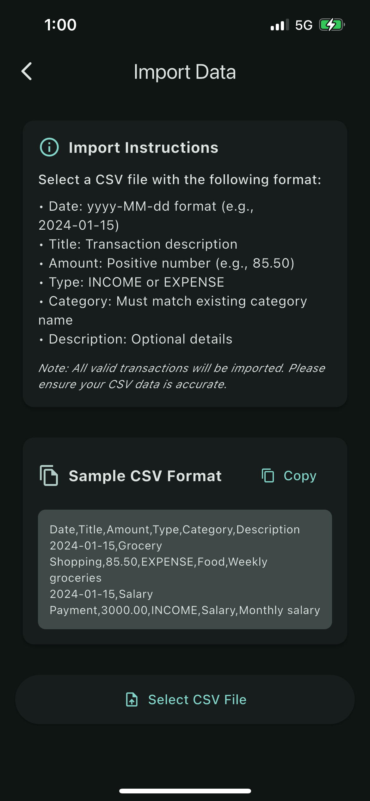
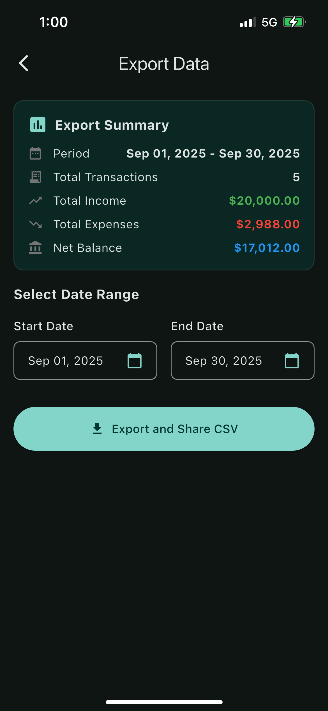
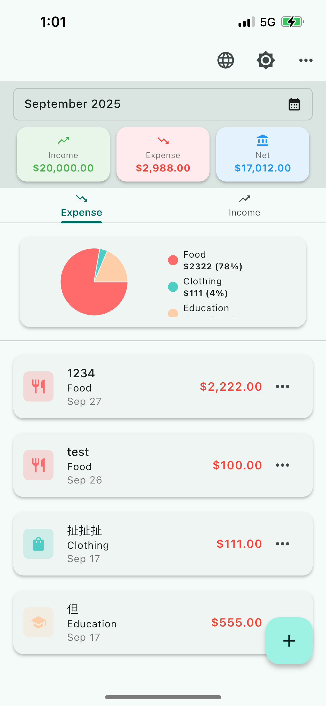
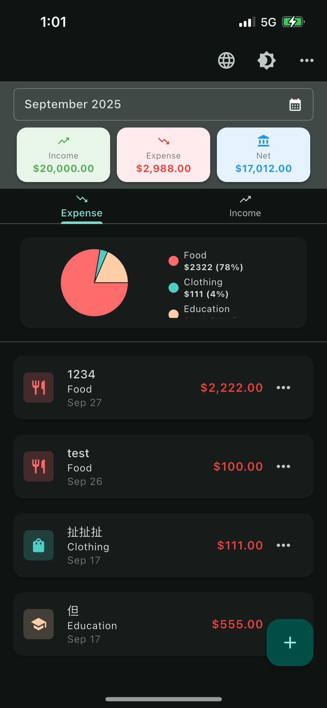

# 💰 Expense Tracker

A comprehensive cross-platform personal finance management application built with Flutter, featuring income and expense tracking, data visualization, theme management, internationalization, and CSV import/export functionality.

## 🚀 Getting Started

### Prerequisites
- Flutter SDK ^3.9.0
- Dart SDK ^3.9.0
- Supported platforms: iOS, Android, Windows, macOS, Linux

### Main Package Versions
- **sqflite**: ^2.3.0 - SQLite database implementation
- **fl_chart**: ^0.66.0 - Beautiful charts and graphs
- **provider**: ^6.1.2 - State management
- **intl**: ^0.20.2 - Internationalization and localization
- **csv**: ^6.0.0 - CSV file handling
- **share_plus**: ^10.1.2 - Cross-platform sharing
- **path_provider**: ^2.1.4 - File system path access
- **file_picker**: ^8.1.4 - File picker functionality
- **cupertino_icons**: ^1.0.8 - iOS style icons

### Installation

1. **Clone the repository**
   ```bash
   git clone <repository-url>
   cd expense_tracker
   ```

2. **Install dependencies**
   ```bash
   flutter pub get
   ```

3. **Generate localization files**
   ```bash
   flutter gen-l10n
   ```

4. **Run the application**
   ```bash
   flutter run
   ```

### Development Commands

```bash
# Run on specific platforms
flutter run -d <device_id>   # Specific device
flutter run                  # Debug mode

# Build for mobile platforms
flutter build apk --release --no-tree-shake-icons           # Android APK
flutter build ipa --release --no-tree-shake-icons           # iOS IPA (App Store)
flutter build ipa --release --no-tree-shake-icons \
  --export-method development                                # iOS IPA (Development)

# Build for desktop platforms
flutter build windows        # Windows
flutter build macos          # macOS
flutter build linux          # Linux

# Development tools
flutter analyze              # Static code analysis
flutter test                 # Run tests
flutter clean                # Clean build artifacts
flutter doctor               # Check Flutter setup
flutter gen-l10n             # Generate localization files
```

### Important Build Notes
- Use `--no-tree-shake-icons` flag when building release versions due to dynamic IconData usage
- iOS builds require proper signing certificates for distribution
- Built artifacts are placed in `artifacts/` directory for distribution

### Hot Reload
During `flutter run`:
- Press `r` for Hot Reload
- Press `R` for Hot Restart

## ✨ Key Features

### 🏠 Dashboard
- **Dual-panel Design**: Separate overview for income and expense data
- **Month Filtering**: View financial data for specific months/years
- **Real-time Statistics**: Display current month's income, expenses, and balance
- **Pie Chart Visualization**: Visual breakdown of spending by category
- **Transaction List**: View, edit, and delete transactions with hamburger menu

### 💸 Transaction Management
- **Dual Transaction Types**: Support for both income and expense transactions
- **Tabbed Interface**: Separate tabs for income and expense entry
- **Complete Forms**: Amount, title, description, category, and date fields
- **Smart Categories**: Automatic category filtering based on transaction type
- **Form Validation**: Ensures data integrity and completeness

### 📊 Data Analytics
- **Interactive Pie Charts**: Beautiful charts using fl_chart package
- **Category Statistics**: View amounts and percentages by category
- **Time-based Filtering**: Analyze data for specific months or periods
- **Visual Insights**: Clear representation of spending patterns

### 🏷️ Category Management
- **Default Categories**: Pre-built categories for common income and expenses
- **Custom Categories**: Create, edit, and delete custom categories
- **Icon Selection**: Choose from Material Icons for visual identification
- **Color Customization**: Assign colors to categories for easy recognition
- **Protected Defaults**: Default categories are protected from deletion

### 🎨 Theme System
- **Multiple Themes**: Light, dark, and system automatic theme modes
- **Material 3**: Modern Material Design 3 design system
- **Theme Persistence**: User preferences saved to database
- **Instant Switching**: Real-time theme changes using Provider pattern

### 🌐 Internationalization
- **Multi-language**: English and Traditional Chinese support
- **Dynamic Switching**: Change language within the app
- **Persistent Preferences**: Language choices are saved
- **Complete Localization**: All UI text supports internationalization

### 📤 Data Export
- **CSV Format**: Export transaction data as CSV files
- **Date Range Selection**: Choose specific periods for export
- **Cross-platform Sharing**: Share exported files using share_plus
- **Complete Data**: Export includes all transaction details

### 📥 Data Import
- **CSV Import**: Import transactions from CSV files
- **Format Validation**: Automatic validation of CSV file format
- **Duplicate Detection**: Smart detection and prevention of duplicate imports
- **Error Handling**: Detailed error reporting and suggestions
- **Category Mapping**: Automatic mapping or creation of categories

## 🏗️ Architecture

### Technical Stack
- **Flutter**: Cross-platform UI framework
- **SQLite**: Local database storage solution
- **Provider**: State management pattern
- **Material 3**: Modern design system

### Platform Support
- **Mobile**: iOS and Android
- **Desktop**: Windows, macOS, and Linux
- **Note**: Web platform is not supported due to SQLite dependencies

### Architecture Patterns
- **Layered Architecture**: Clean separation of UI, business logic, and data layers
- **Provider Pattern**: ChangeNotifier-based state management
- **Singleton Pattern**: Database helper with single instance design
- **Dependency Injection**: Provider-based dependency management

## 📁 Project Structure

```
lib/
├── main.dart                              # Application entry point
├── database/
│   └── database_helper.dart              # SQLite database operations
├── models/
│   ├── transaction.dart                   # Transaction data model
│   ├── category.dart                      # Category data model
│   ├── theme_preference.dart              # Theme preference model
│   └── language_preference.dart           # Language preference model
├── screens/
│   ├── new_home_screen.dart              # Main dashboard screen
│   ├── add_transaction_screen.dart       # Add transaction screen
│   ├── category_management_screen.dart   # Category management screen
│   ├── add_category_screen.dart          # Add/edit category screen
│   ├── export_screen.dart                # Data export screen
│   └── import_screen.dart                # Data import screen
├── widgets/
│   ├── transaction_list.dart             # Transaction list component
│   ├── transaction_chart.dart            # Pie chart component
│   ├── theme_toggle_button.dart          # Theme toggle button
│   ├── language_toggle_button.dart       # Language toggle button
│   ├── month_year_picker.dart            # Month/year picker
│   ├── multi_month_picker.dart           # Multi-month picker
│   └── year_month_picker.dart            # Year/month picker
├── providers/
│   ├── theme_provider.dart               # Theme state management
│   └── language_provider.dart            # Language state management
├── services/
│   ├── theme_service.dart                # Theme configuration service
│   ├── language_service.dart             # Language configuration service
│   ├── csv_export_service.dart           # CSV export service
│   └── csv_import_service.dart           # CSV import service
└── l10n/
    ├── app_localizations.dart            # Localization base class
    ├── app_localizations_en.dart         # English localization
    └── app_localizations_zh.dart         # Traditional Chinese localization
```

## 🗄️ Database Schema

### Transactions Table
- Stores all income and expense transactions
- Links to categories via foreign key
- Includes amount, title, description, date, and type

### Categories Table
- Manages both default and custom categories
- Stores display names, icons, colors, and type (income/expense)
- Supports category creation and customization

### Preferences Tables
- Theme preferences (light/dark/system)
- Language preferences (English/Traditional Chinese)
- Persistent storage of user choices

## 🔧 Technical Implementation Details

### Database Constraints & Error Handling

#### Category Model Constraints
- **Unique Constraint**: `UNIQUE(display_name, is_income_category)` prevents duplicate category names within the same type
- **Cross-Type Flexibility**: Categories can have identical display names across income/expense types
- **No Internal Names**: Simplified model using only user-facing display names

#### Error Handling Pattern
```dart
try {
  await DatabaseHelper.instance.updateCategory(category);
} catch (e) {
  if (e.toString().contains('Category with this display name already exists')) {
    // Display localized duplicate name error
    showSnackBar(AppLocalizations.of(context)!.categoryNameAlreadyExists);
  } else {
    // Display generic error message
    showSnackBar(AppLocalizations.of(context)!.errorSavingCategory);
  }
}
```

#### Key Design Decisions
- **Exception-Based Validation**: Database layer throws exceptions for constraint violations
- **UI Error Translation**: User interface catches exceptions and displays appropriate localized messages
- **Fail-Fast Approach**: Validation occurs at the database level for data integrity

## 🧪 Testing

### Test Configuration
- Uses `sqflite_common_ffi` for desktop platform testing
- Database factory initialization required in `setUpAll()`
- Widget tests need additional `await tester.pump()` for database loading

### Running Tests
```bash
flutter test                    # Run all tests
flutter test test/widget_test.dart  # Run specific test file
```


## 📄 License

This project is licensed under the MIT License - see the [LICENSE](LICENSE) file for details.

---

**Enjoy managing your personal finances with Expense Tracker!** 💰✨

## 📱 Screenshots

### 🏠 Main Interface & Features
<div align="center">
  
  
  
</div>

<div align="center">
  <strong>Home Dashboard</strong>&nbsp;&nbsp;&nbsp;&nbsp;&nbsp;&nbsp;&nbsp;&nbsp;&nbsp;&nbsp;&nbsp;&nbsp;&nbsp;&nbsp;&nbsp;&nbsp;&nbsp;&nbsp;&nbsp;&nbsp;&nbsp;&nbsp;&nbsp;&nbsp;&nbsp;&nbsp;&nbsp;&nbsp;&nbsp;&nbsp;&nbsp;&nbsp;<strong>Add Transaction</strong>&nbsp;&nbsp;&nbsp;&nbsp;&nbsp;&nbsp;&nbsp;&nbsp;&nbsp;&nbsp;&nbsp;&nbsp;&nbsp;&nbsp;&nbsp;&nbsp;&nbsp;&nbsp;&nbsp;&nbsp;&nbsp;&nbsp;&nbsp;&nbsp;&nbsp;&nbsp;&nbsp;&nbsp;&nbsp;&nbsp;&nbsp;&nbsp;<strong>Category Management</strong>
</div>

### 🔧 Data Management
<div align="center">
  
  
</div>

<div align="center">
  <strong>Data Import</strong>&nbsp;&nbsp;&nbsp;&nbsp;&nbsp;&nbsp;&nbsp;&nbsp;&nbsp;&nbsp;&nbsp;&nbsp;&nbsp;&nbsp;&nbsp;&nbsp;&nbsp;&nbsp;&nbsp;&nbsp;&nbsp;&nbsp;&nbsp;&nbsp;&nbsp;&nbsp;&nbsp;&nbsp;&nbsp;&nbsp;&nbsp;&nbsp;&nbsp;&nbsp;&nbsp;&nbsp;&nbsp;&nbsp;<strong>Data Export</strong>
</div>

### 🌍 Theme Options
<div align="center">
  
  
</div>

<div align="center">
<strong>Light Theme</strong>&nbsp;&nbsp;&nbsp;&nbsp;&nbsp;&nbsp;&nbsp;&nbsp;&nbsp;&nbsp;&nbsp;&nbsp;&nbsp;&nbsp;&nbsp;&nbsp;&nbsp;&nbsp;&nbsp;&nbsp;&nbsp;&nbsp;&nbsp;&nbsp;&nbsp;&nbsp;&nbsp;&nbsp;&nbsp;&nbsp;&nbsp;&nbsp;&nbsp;&nbsp;&nbsp;<strong>Dark Theme</strong>
</div>
